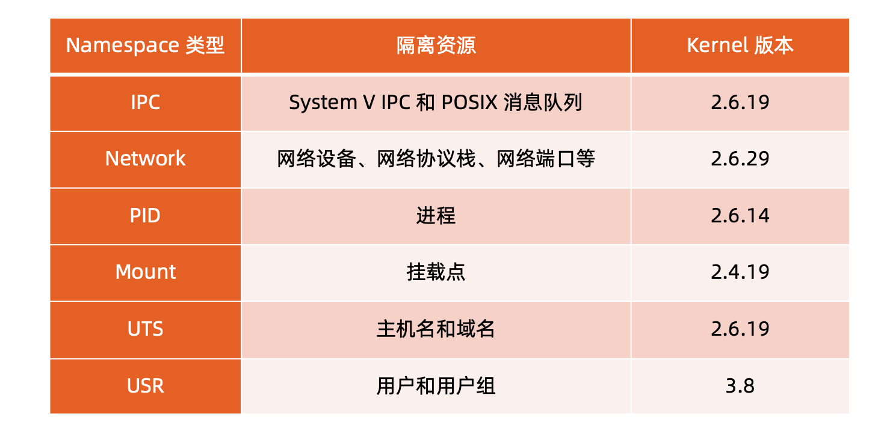
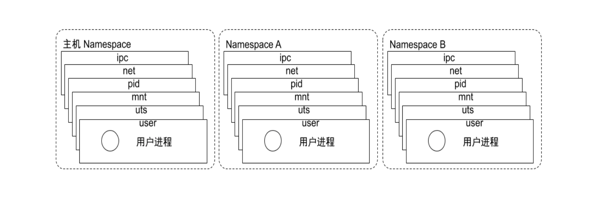

# 参考
[极客时间-孟凡杰-云原生训练营](https://u.geekbang.org/subject/cloudnative?utm_source=time_web&utm_medium=menu&utm_term=timewebmenu&utm_identify=geektime&utm_content=menu&utm_campaign=timewebmenu&gk_cus_user_wechat=university)

# 从系统架构谈起

传统的分层架构 VS 微服务

* 在复杂的系统中，很多开发人员对一个系统进行开发，到最后造成的结果是没有一个人完全了解整个系统。导致项目越来越难维护和升级。

* 后续衍生出了SOA架构,对复杂的系统进行模块化的拆分，通过企业服务总线(Enterprise Service Bus)来连接各个组件。这样做的后果是ESB又成为了一个单体架构，越来越大导致不可维护。

* 到现在最新的微服务架构。微服务架构其实是SOA架构的一种实现。同时也是升华。相比于SOA架构，微服务强调将服务更加的细化。将业务需要更彻底的组件化和服务化。使得业务系统拆分为可以独立开发、设计、运行的小应用，且每个应用之间都通过过程调用等轻量级的通信方式完成交互。

## 微服务之间的通信方式

* 点对点的方式
	* 多用于系统内部组件之间通讯
	* 有大量的重复模块如认证授权
	* 缺少统一的规范，如监控审计。
	* 后期维护成本高，服务和服务之间的关系错综复杂难以理解。
* api网关
	* 基于一个轻量级的消息网关
	* 对下层微服务公共部分进行整合。认证 授权 监控 限流 熔断等。

# 理解Dcoekr

## docker的由来

* 基于 Linux 内核的 Cgroup，Namespace，以及 Union FS 等技术，对进程进行封装隔离，属于操作系统 层面的虚拟化技术，由于隔离的进程独立于宿主和其它的隔离的进程，因此也称其为容器。

* 最初实现是基于 LXC，从 0.7 以后开始去除 LXC，转而使用自行开发的 Libcontainer，从 1.11 开始，则 进一步演进为使用 runC 和 Containerd。
* **Docker 在容器的基础上，进行了进一步的封装**，从文件系统、网络互联到进程隔离等等，极大的简化了容 器的创建和维护，使得 Docker 技术比虚拟机技术更为轻便、快捷。

## 为什么用Docker

* 更高效的利用系统资源
* 更快速的启动时间
* 一致的运行环境
* 持续交付和部署
* 更轻松的迁移
* 更轻松的维护和扩展

运行态对比:

性能对比:

最后:

容器是操作系统层面的虚拟化技术，docker是基于容器技术实现的一种产品。由于docker的出现，把容器这个概念带火了。后来就把docker和容器等价了。其实并不是。

# 容器的主要特性

## Namespace

* Linux Namespace 是一种Linux Kernel提供的资源隔离方案。系统可以为进程分配不同的Namespace，并保证不通的Namespace资源独立分配，进程彼此隔离，不同的Namespace下的进程互不干扰。

 

Linux对Namespace的操作方法

* clone 在创建新的进程系统调用时，可以通过flag参数指定需要新建的Namespace类型

* setns 该系统调用可以让调用进程加入某个已存在的Namespace中
* unshare 该系统调用可以调用进程移动到新的Namespace下

## Namespace 隔离性

* pid namespace

不同用户的进程就是通过 Pid namespace 隔离开的，且不同 namespace 中可以有相同 Pid。
有了 Pid namespace, 每个 namespace 中的 Pid 能够相互隔离。

* net namespace

网络隔离是通过 net namespace 实现的， 每个 net namespace 有独立的 network devices, IP addresses, IP routing tables, /proc/net 目录。  
Docker 默认采用 veth 的方式将 container 中的虚拟网卡同 host 上的一个 docker bridge: docker0 连接 在一起。

* ipc namespace

Container 中进程交互还是采用 linux 常见的进程间交互方法 (interprocess communication – IPC), 包 括常见的信号量、消息队列和共享内存。  
container 的进程间交互实际上还是 host上 具有相同 Pid namespace 中的进程间交互，因此需要在 IPC 资源申请时加入 namespace 信息 - 每个 IPC 资源有一个唯一的 32 位 ID

* mnt namespace

mnt namespace 允许不同 namespace 的进程看到的文件结构不同，这样每个 namespace 中的进程所看 到的文件目录就被隔离开了。  

* uts namespace

UTS(“UNIX Time-sharing System”) namespace允许每个 container 拥有独立的 hostname 和 domain name, 使其在网络上可以被视作一个独立的节点而非 Host 上的一个进程

* user namespace

每个 container 可以有不同的 user 和 group id, 也就是说可以在 container 内部用 container 内部的用户 执行程序而非 Host 上的用户。

## Namespace 常用操作

*  查看当前系统的 namespace: lsns –t <type>
* 查看某进程的 namespace: ls -la /proc/<pid>/ns/
* 进入某 namespace 运行命令: nsenter -t <pid> -n ip addr

## CGroup

