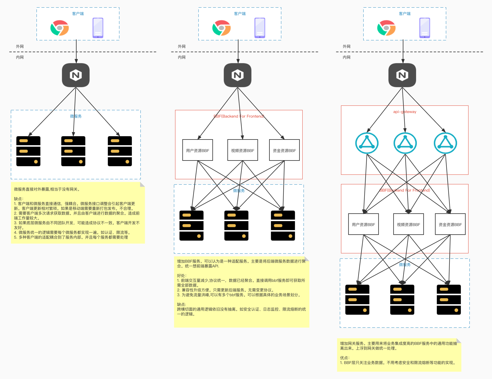

# 微服务与SOA的关系

>  *  SOA(Service Oriented Architecture) “面向服务的架构”。是一种设计架构的方法。其理念是每个服务以独立的形式存在于操作系统进程中。每个服务之间通过网络调用。    
> 
> *  微服务架构: 微服务类似于SOA架构，可以看作是SOA架构的一种实现，同时也是升华。相比于SOA架构，微服务强调将服务更加的细化。将业务需要更彻底的组件化和服务化。使得业务系统拆分为可以独立开发、设计、运行的小应用。也就是微应用。这些小应用之间通过过程调用完成交互和集成。
> 

# 微服务优缺点

微服务中的每个服务负责的都是单一的业务。符合架构设计的单一原则理念。  
微服务中的每个服务都是独立的进程,可以自动独立部署。服务间采用轻量级通信机制，可以使用不同的语言或者数据存储技术。  
通过使用容器编排技术 k8s等。使得服务以容器化的方式进行快速的，方便的隔离部署。

微服务从1个服务变成了多个服务。此时也会带来一些问题:

1. 基础设施的建设复杂度变高。
2. 解决或者跟踪问题的方式变得复杂。
3. 必须手动处理服务之间远程调用过慢或者失败的问题。
4. 微服务的每个服务都有自己的独立的数据库。会带来数据一致性的问题。
5. 单个服务出问题时容易引起连锁反应导致整个服务不可用。

# 微服务如何落地

1. 服务组件化
	* kit 一个微服务的基础库
	* service  kit+业务代码+第三方依赖
	* rpc + message queue
2. 去中心化
	* 数据去中心化 每个服务独享自己的数据存储设置(缓存,数据库等)
	* 治理去去中心化 
	* 技术去中心化
3. 基础设施自动化
	* CI/CD   自动构建集成部署。
	* Testing   测试环境，单元测试，api测试
	* 在线运行 k8s. 日志采集，报警。仪表盘等。
4. 可用性和兼容性设计  
    对于可用性，要有Design For Failure思想。假设所有环节或者依赖都会失败来倒推你的设计。尽量采用粗粒度的的进程间通信(批量请求接口)。
    * 隔离
    * 超时控制
    * 负载保护
    * 限流
    * 降级
    * 重试
    * 负载均衡  
	
	兼容性的设计要做到设计谨记保持服务契约(api)的兼容性  
    Be conservative in what you send, be liberal in what you accept.  
    发送时要保守，接收时要开放。按照伯斯塔尔法则的思想来设计和实现服务时，发送的数据要更保守，
意味着最小化的传送必要的信息，接收时更开放意味着要最大限度的容忍冗余数据，保证兼容性。

# 微服务如何设计

## API网关的设计和演进

## 服务如何划分

* 按照公司部门或者模块划分。
* DDD领域驱动设计的方式划分。  
	限界上下文是 DDD 中用来划分不同业务边界的元素， 这里业务边界的含义是“解决不同业务问题”的问题域 和对应的解决方案域，为了解决某种类型的业务问题， 贴近领域知识，也就是业务
* CQRS

## 安全设计

服务外部：

* 网关鉴权。 限流熔断的操作。生成内部的token，传递到下一层BBF
* BBF 解析token 获取用户id 传递到服务层
* 服务层直接使用用户id

服务内部：

* full trust 
* half trust
* zero trust

采用证书等方式实现服务的认证和授权。

#  服务发现

* 发现类型

	* 客户端发现：直连，比服务端服务发现少一次网络跳转，Consumer 需要内置特定的服务发现客户端和发现逻辑。
	* 服务端发现：Consumer 无需关注服务发现具体细节，只需知道服务的 DNS 域名即可，支持异构语言开发，需要基础设施支撑，多了一次网络跳转，可能有性能损失。

* 通过 Family(appid) 和 Addr(IP:Port) 定位实例，除此之外还可以附加更多的元数据：权重、染色标签、集群等。
* Provider 注册后定期(30s)心跳一次，注册， 心跳，下线都需要进行同步，注册和下线需要进行长轮询推送。
* Consumer 启动时拉取实例，发起30s长轮询
* Server 定期(60s) 检测失效(90s)的实例，失效则剔除。短时间里丢失了大量的心跳连接(15分钟内心跳低于期望值*85%)，开启自我保护，保留过期服务不删除。
 
 
    
    