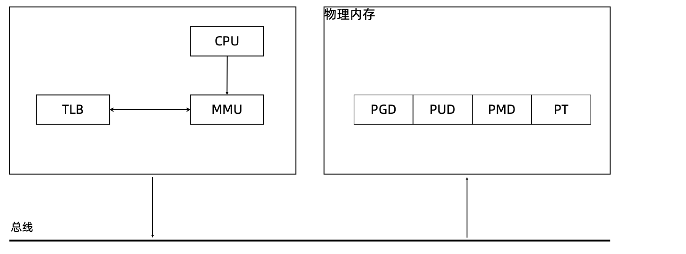
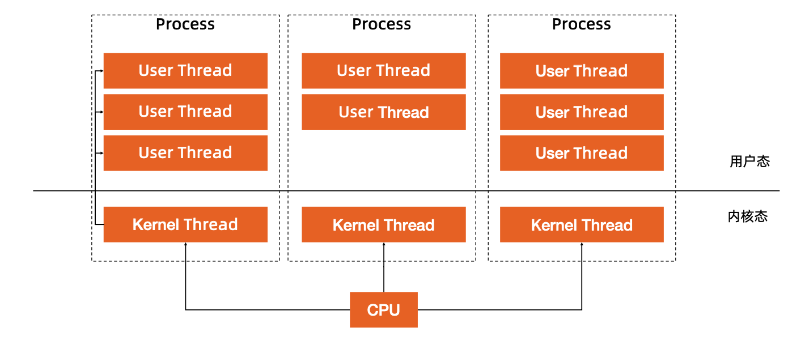
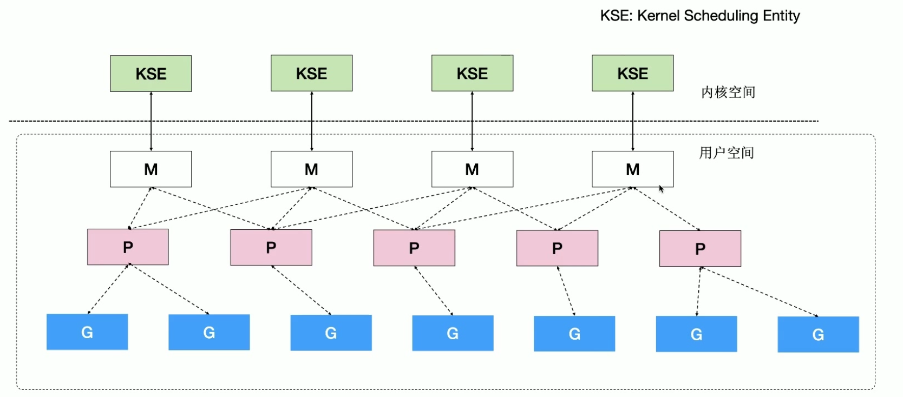
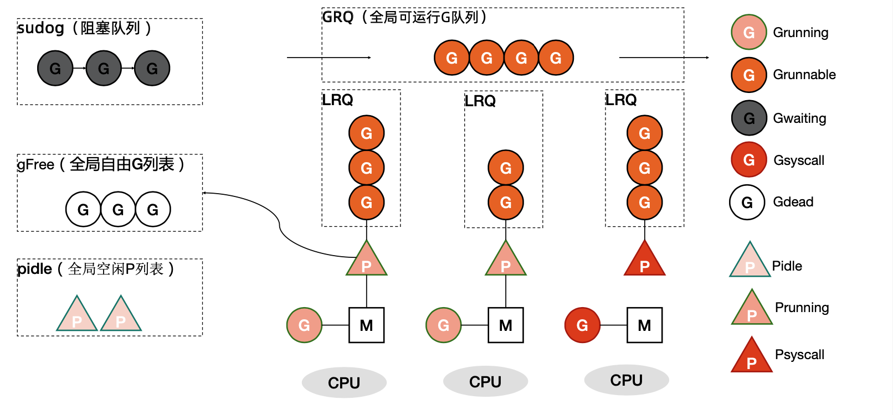
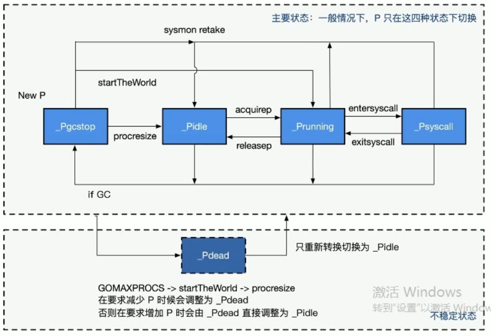

# 参考
[极客时间-孟凡杰-云原生训练营](https://u.geekbang.org/subject/cloudnative?utm_source=time_web&utm_medium=menu&utm_term=timewebmenu&utm_identify=geektime&utm_content=menu&utm_campaign=timewebmenu&gk_cus_user_wechat=university)

# 前置知识

Golang作为一门新的语言，使用了用户态线程-协程这个概念。为什么会有协程这个概念，他和线程以及进程有什么却别？好处有哪些呢？

首先我们需要对一些基本知识有一定的了解，以此为基础来更深刻的了解为什么Golang要写一个Goroutine出来。

## 进程和线程

* 进程: 资源分配的基本基本单位。
* 线程: 调度的基本单位
* 无论是进程还是线程,在linux中都以task_struct描述。从内核角度看,进程与线程没有本质的区别。线程就是没有自己独立资源的进程。

在linux中，进程的创建一般使用fork，fork出来的进程与原始的进程只有父子关系。而没有其他的联系。fork出来的进程有自己单独的内存空间，文件系统，文件操作符已经信号

线程的创建一般使用pthread_cretae, 线程的创建不会重新分配资源，而是与原来的process共享其资源。


## 进程内存

在现代的计算机中,操作系统都是支持多进程的。如果直接让多个进程直接访问物理内存,内存的分配会出现问题。由此引出了虚拟内存。

虚拟内存和物理内存的关系是通过页表维护的。为了避免页表数据量太大，linux使用了多级页表来减少页表对于内存的开销。

每启动一个进程，操作系统就为进程生成一个虚拟内存来对应到物理内存。在linux中内核中进程的虚拟内存划分如图。


我们可以使用size命令直接查看应用程序虚拟内存中每个段所占用的大小。

```go
package  main


const name = "aaa"
func main(){

}
```

```bash
# 编译以上程序
go build main.go

size main
__TEXT  __DATA  __OBJC  others  dec     hex
753664  224672  0       16829856        17808192        10fbb40
# 获取操作系统页表大小
getconf PAGE_SIZE
4096
```

## CPU 对于内存的访问

*  CPU上有个Memory Management Uint(MMU)单元 
*  CPU 把虚拟地址给MMU,MMU去物理内存中查询页表，得到实际的物理地址。
*  CPU维护一份缓存 Translation Lookaside Buffer(TLB),缓存虚拟地址和无物理地址的映射关系。




## 进程切换的开销

综上，我们可以知道，如果切换进程需要有以下开销:

* 直接开销
	* 切换页表全局目录(PGD)。因为每个进程都有自己独立的进程虚拟地址空间。进程的切换代表着整个虚拟地址空间的切换。
	* 切换内核态堆栈
	* 切换上下文(保存进程执行)
	* 刷新TLB
	* 系统调度器的代码执行。
* 间接开销
	* CPU缓存生效导致进程需要到内存直接访问的IO操作变多。

## 线程切换开销

* 线程本质上只是一批共享资源的进程，线程切换本质上依然需要内核进行进程切换。
* 由于线程共享内存资源，因此一个进程的所有线程共享虚拟地址空间，线程切换相比于进程切换，主要节省了**虚拟地址空间的切换**


## 用户线程(协程)

通过一些前置知识，我们知道。就算是多个线程之间的切换，也只是节省了 虚拟地址空间的切换的开销。切换过程中依然需要内核进行操作。

有没有一种方法，可以在无需内核帮助下，应用程序在用户空间创建可执行的单元，创建销毁完全在用户态完成。 这就是用户态线程，也叫轻量级线程，也就是协程。

假设一个cpu上同时有多个内核级线程，这几个线程通过非抢占式调度策略来均匀的使用cpu的划分的时间片。如果我们可以在用户态创建多个用户态的线程，并绑定到一个内核线程。当在这个内核线程有效的时间片内，某一个用户态线程发生了阻塞，我们可以在切换到另一个用户态线程，此时的切换完全发生在用户空间，节省了内核部分的很大开销。




基于用户态线程这种切换可以节省很大的开销，无需操作系统进行系统调用完成系统级的线程切换。


**Golang语言就是基于此种机制设计并实现了自己的协程-goroutine。**


# Goroutine

## 介绍

Go语言基于PMG模型实现了用户态线程。

* G: 表示goroutine,每个goroutine都有自己的栈空间，定时器。初始化的栈空间在2k左右，空间随着需求增长。
* M: 抽象化代表内核线程,记录内核线程栈信息，当goroutine调度到线程时,使用该goroutine自己的展信息。
* P: 代表调度器,负责调度goroutine,维护一个本地的goroutine队列，m从p上获得goroutine并执行，同时还负责部分内存的管理。


## PMG模型细节

内核线程和M的对应关系：





* 程序启动时首先会根据系统CPU的数量启动M
* 然后golang会维护一个P列表，当系统中没有任何goroutine时,这些P上是没有任何任务的。最常见的P是运行状态，此时P是被分配的M上的。如果P中的goroutine有系统调用并且被M获取到这个groutine，此时这个M陷入到系统调用中。P会和他解绑并寻找其他空闲的M。
* 全局的goutine free是一个线程池的概念，我不需要没都新建gouritne实例。当新建gouritne先看全局的free队列有没有，有的话直接使用。使用完了再放回。
* 每个P会维护一个本地的goroutine队列。同时还有一个全局可运行的groutine队列。新建的goutine会首先尝试放入当前的P本地队列中，数量超过256个后放入全局队列中。
* P队列中的goroutine是不平衡的。如果当前P中没有可执行的goroutine,则先到全局可运行队列中找。如果也没有，从其他的P中找，直接取一半。叫做工作窃取。
* 如果groutine有阻塞，则放入阻塞队列。
* 如果一个P被调度到了M上，除非要系统调动等情况发生，P是不会主动与M解除关系的。这样就大大的减少了线程的切换。

## P的状态

Pidle: 处理器没有运行用户代码或者调度器。被空闲队列或者改变其状态的结构持有，运行队列为空。
Prunning: 被线程M持有,并且正在执行用户代码或者调度器。
PSyscall: 没有执行用户代码，当前线程陷入系统调用。
Pgcstop: 被线程M持有，当前处理器由于垃圾回收被停止。
Pdead: 当前吹起已经不被使用。



## G的状态

Gidle: 刚刚被分配并且还没有被初始化，值为0，为创建goroutine后的默认值。
Grunabele: 没有执行代码，没有栈的所有权，存储在运行队列中，可能在某个P的本地队列或者全局队列中。
Grunning: 正在执行代码的goroutine,拥有栈的所有权。
Gsyscall: 正在执行系统调用，拥有栈的所有权，与P脱离，但是与某个M绑定，会在调用结束后被分配到运行队列。
Gwating: 被阻塞的goroutine,阻塞在某个channel的发送或者接收队列。
Gdead: 当前goroutine未被使用，没有执行代码，可能有分配的栈，分布在空闲列表gFree，可能是一个刚刚初始化goroutine，也可能是执行了goexit退出的goroutine.
Gcopystac: 栈正在被拷贝，没有执行代码，不在运行队列上，执行权在。
Gscan: GC正在扫描栈空间，没有执行代码，可以与其他状态同时存在。


## G所处的位置

* 进程都有一个全局的G队列。
* 每个P拥有自己的本地执行队列。
* 在上面两个队列中的G都是可运行的。如果不在上诉两个队列中，则可能在以下位置：
	* 处于channel阻塞状态的G被放在sudog
	* 脱离了P绑定在M上的G,系统调用。
	* 为了复用，执行结束进入P的gFree队列。
## G创建过程

* 获取或者创建新的Groutine结构体
	* 从处理器的gFree列表中查询空闲的Goroutine。
	* 如果不存在空闲的goroutine，会通过runtime.malg创建一个栈大小足够的新结构体。
* 将函数传入的参数移到goroutine的栈上。
* 更新goroutine调度相关的属性，更新状态为Grunnable
* 返回的goroutine会存储在全局变量allgs中。

##  调度器的行为

* 为了保证公平，当全局队列中有待执行的g时，通过调度算法保证有一定的几率(1/61)会从全局的奴性队列中查找对应的g。
* 从处理器本地的运行队列中渣朝待执行的g
* 如果前两种方法都没有找到g，会通过runtime.findrunnable进行阻塞的查找g。
	* 从本地队列，全局队列中找。
	* 从网络轮询器中查找是否有g等待运行。
	* 通过runtime.runqsteal尝试从其他随机的处理器中窃取一半待运行的g。


