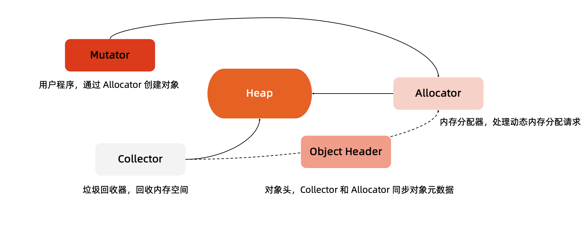
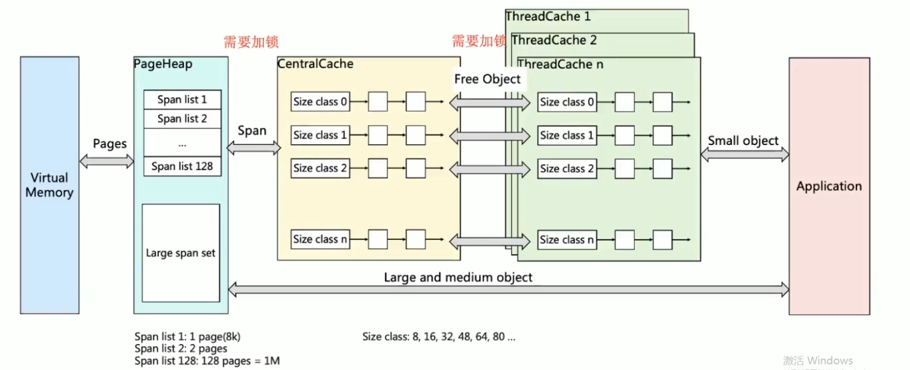
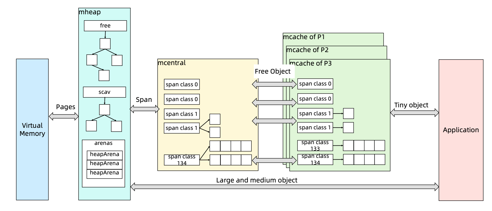
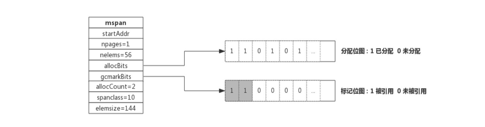
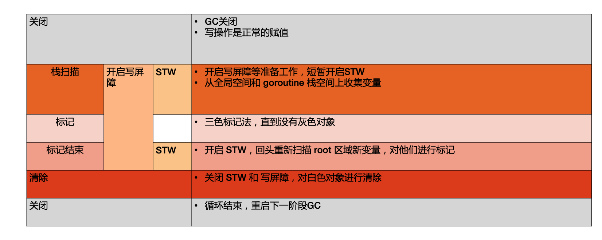

# 前言

我们Golang进程调度我们知道内存可以分为数据段，代码段和堆栈等。对于java或者golang等高级的语言来说，他们的内存管理主要是针对堆的内存管理。

# 堆内存的管理机制

* 初始化连续的内存块作为堆内存
* 有内存申请的时候，Allocator从堆内存的未分配区域分割小内存块。
* 用链表将已经分配的内存连接起来。
* 需要信息描述每个内存块的元数据: 大小，是否使用，下一个内存块的地址等。
* 内存回收就是扫描堆内存，将不再被使用的内存设置为unused.

 堆内存管理的挑战:
 
 1. 内存分配需要系统调用，在频繁内存分配的时候,系统性能较低。
 2. 多线程共享相同的内存空间，同时申请内存时，需要加锁，否则会产生同一块内存被多个线程访问的情况。
 3. 内存碎片化问题，经过不断的内存分配和回收，内存碎片会比较严重，内存的使用效率降低。

# TCMalloc
 
 
 
 * page： 内存页，一块8k大小的内存空间。Go与操作系统之间的内存申请和释放，都是以page为单位的。
 * span： 内存块，一个或多个连续的page组成一个span
 * sizeclass: 空间规格，每个span都带有一个sizeclass,标记着span中的page该如何使用
 * object:对象，用来存储一个变量数据内存空间，一个span在初始化时，会被切割成一堆等大 的 object ;假设 object 的大小是 16B ，span 大小是 8K ，那么就会把 span 中的 page 就会 被初始化 8K / 16B = 512 个 object 。所谓内存分配，就是分配一个 object 出去

 
 * 对象大小定义
	* 小对象大小:0~256KB
	* 中对象大小:256KB~1MB 
	* 大对象大小:>1MB
* 小对象的分配流程
	* ThreadCache -> CentralCache -> HeapPage，大部分时候，ThreadCache 缓存都是足够的，不需要去访问 CentralCache 和 HeapPage，无系统调用配合无锁分配，分配效率是非常高的
* 中对象分配流程
	* 直接在 PageHeap 中选择适当的大小即可，128 Page 的 Span 所保存的最大内存就是 1MB 
* 大对象分配流程
	* 从 large span set 选择合适数量的页面组成 span，用来存储数据

# Go语言内存分配

 

# 内存回收

## 回收方式

* 引用计数(Python,PHP,Swift)
	* 每一个对象维护一个引用计数,当引用该对象的对象被销毁的时候，引用计数减1，当引用计数为0的时候，回收该对象。
	* 优点： 对象可以很快的被回收，不会出现内存耗尽或达到某个阈值时才回收
	* 确定： 不能很好的处理循环引用，而且实时维护引用计数，有一定的代价。
* 标记-清除(golang)
	* 从根变量开始遍历所有引用的对象，引用的对象被标记为“被引用”，没有被标记的进行回收
	* 优点： 解决引用计数的缺点
	* 缺点： 需要STW.
* 分代收集
	* 按照生命周期进行划分不同的代空间，生命周期长的放入老年代，短的放入新生代，新生代的回收频率高于老年代的频率。

mspan结构：

 

span由多个page组成。每个span按照sizeclass切分成多个块。 下面的位图就代表这些内存块的分配情况。

* allocBits 记录了每块内存分配的情况
* gcmarkBits 记录了每块内存的引用情况，标记阶段对每块内存进行标记，有对象引用的内存标记为1，没有标记为0
* 这两个位图的数据结构完全是一致的，标记接收则进行内存回收，会后的时候，将alloBits指向gcmarkBits，标记过的则存在，未进行标记的则进行回收。

## GC工作流程
 
 Golang GC的大部分处理是和用户代码并行的。
 
 * Mark:
 	* Mark Prepare: 初始化gc任务，包括开启写屏障和辅助GC,统计root对象的任务数量等。这个过程需要STW.
 	* GCDrains:扫描所有root对象，包括全局指针和goroutine(G)栈上的指针(扫描对应G栈时需停止该G)，将其 加入标记队列(灰色队列)，并循环处理灰色队列的对象，直到灰色队列为空。该过程后台并行执行
 
* MarkTermination:完成标记工作，重新扫描(re-scan)全局指针和栈。因为Mark和用户程序是并行的，所以在Mark过 程中可能会有新的对象分配和指针赋值，这个时候就需要通过写屏障(write barrier)记录下来，re-scan 再检查一下，这 个过程也是会 STW 的
* Sweep:按照标记结果回收所有的白色对象，该过程后台并行执行
* SweepTermination:对未清扫的span进行清扫,只有上一轮的GC的清扫工作完成才可以开始新一轮的GC

## GC工作流程

 
 

## 三色标记

* GC开始时，认为所有object都是白色，即垃圾
* 从root区开始遍历，被触达的object直为灰色。
* 遍历所有灰色，将他们内部的引用变量置为灰色，自身为黑色。
* 循环第三步，直到没有灰色的object，只剩下黑白两种，白色的是垃圾，黑色的为活跃对象。
* 对于黑色的object，如果在标记期间发生了写操作，写屏障会在真正赋值前将新对象标记为灰色。
* 比较过程中，mallocgc 新分配的object，会先被标记成黑色，再返回。

## 垃圾回收触发机制

* 内存分配量达到阈值触发GC 
	* 每次内存分配时都会检查当前内存分配量是否达到阈值。阈值=上次gc内存分配量*内存增长率。
	* 内存增长率由变量GOGC控制。默认为100.即每当内存扩大一倍时，启动GC.
* 定期触发GC
	* 默认情况下 最长2分钟触发一次。这个间隔在 src/runtime/proc.go:forcegcperiod 变量中被声明

* 手动触发
	* 程序代码中也可以使用 runtime.GC()来手动触发 GC。这主要用于 GC 性能测试和统计。
