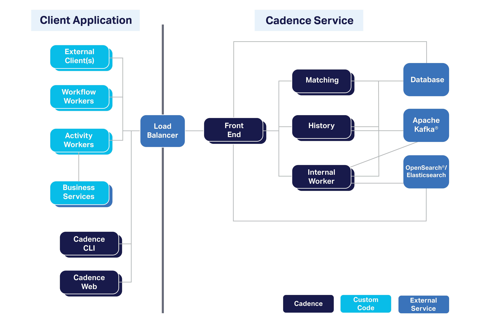
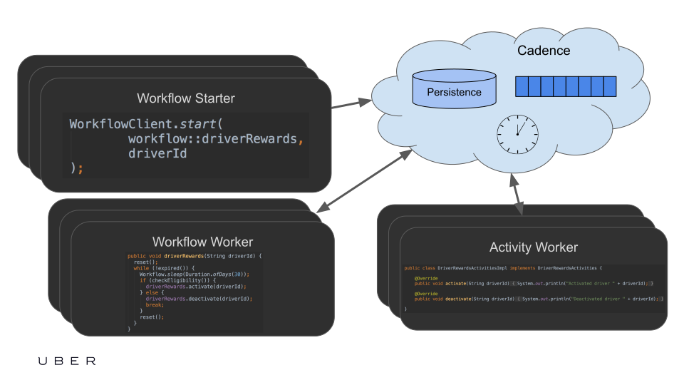

# 思想

Cadence是一种开发分布式应用程序的新方法。 

它借用了工作流自动化领域的核心术语。所以它的概念包括工作流和活动。工作流可以对事件做出反应，并通过查询返回内部状态。 

部署拓扑解释了如何将所有这些概念映射到可部署的软件组件。

# 无关错误的有状态工作流代码

## 概览

 Cadence核心抽象是一个无错误的有状态工作流。工作流代码的状态(包括它创建的局部变量和线程)不受流程和Cadence服务失败的影响。这是一个非常强大的概念，因为它封装了状态、处理线程、持久计时器和事件处理程序。 
 
## 例子
 
 让我们来看一个用例。客户注册一个有试用期的应用程序。在此期间之后，如果客户没有取消，他应该被收取每月一次的续费。客户必须通过电子邮件收到有关收费的通知，并且应该能够在任何时候取消订阅。
 
 这个用例的业务逻辑不是很复杂，可以用几十行代码来表示。但是任何实际实现都必须确保业务流程是容错和可伸缩的。有各种方法来设计这样一个系统。
 
 一种方法是以数据库为中心。应用程序流程将定期扫描处于特定状态的客户的数据库表，执行必要的操作，并更新状态以反映这一点。虽然可行，但这种方法有各种缺点。最明显的是，客户状态的状态机很快变得极其复杂。例如，刷卡或发送电子邮件可能会由于下游系统不可用而失败。失败的调用可能需要长时间重试，理想情况下使用指数重试策略。应该对这些调用进行限制，以避免外部系统超载。应该支持“毒丸”，以避免在由于任何原因无法处理单个客户记录时阻塞整个过程。基于数据库的方法通常也存在性能问题。对于需要对处于特定状态的记录进行持续轮询的场景，数据库并不有效。
 
 另一种常用的方法是使用计时器服务和队列。任何更新都会被推送到队列中，然后从队列中消费的worker会更新数据库，并可能在下游队列中推送更多的消息。对于需要调度的操作，可以使用外部定时器服务。这种方法通常可伸缩性要好得多，因为数据库不需要经常轮询更改。但它使编程模型更加复杂，也更容易出错，因为队列系统和数据库之间通常不存在事务更新。
 
 使用Cadence，整个逻辑可以封装在一个简单的持久函数中，该函数直接实现业务逻辑。因为函数是有状态的，所以实现者不需要使用任何额外的系统来确保持久性和容错性。
 
 
 学习Cadence的开发人员经常会问的问题是“我如何处理工作流工作者过程失败/在我的工作流中重新启动”?答案是你不需要。工作流代码完全不受任何工作人员的故障和停机，甚至不受Cadence服务本身的影响。一旦它们被恢复，工作流需要处理一些事件，比如计时器或活动完成，工作流的当前状态就会完全恢复，继续执行。工作流失败的唯一原因是工作流业务代码抛出异常，而不是底层基础设施中断。
 
 
  另一个经常被问到的问题是，一个worker是否能够处理比其缓存大小或支持的线程数量更多的工作流实例。答案是，当工作流处于阻塞状态时，可以安全地从worker中移除。之后，当需要(以外部事件的形式)出现时，它可以在不同的或相同的工作者身上复活。因此，假设一个worker可以处理数百万个开放工作流的执行，前提是它可以处理更新速度。 
  

##  状态恢复和决定论

工作流状态恢复利用了事件来源，这对代码的编写方式有一些限制。主要的限制是工作流代码必须是确定性的，这意味着如果多次执行，它必须产生完全相同的结果。这就排除了工作流代码中的任何外部API调用，因为外部调用可能间歇性地失败或随时改变其输出。这就是为什么所有与外部世界的交流都应该通过活动进行。出于同样的原因，工作流代码必须使用Cadence api来获取当前时间、睡眠和创建新线程。

## 标识唯一性

工作流ID是由客户端在启动工作流时分配的。它通常是一个业务级ID，如客户ID或订单ID

Cadence保证在任何时候每个域只有一个给定ID打开的工作流(跨所有工作流类型)。使用相同ID启动工作流的尝试将会失败，并出现WorkflowExecutionAlreadyStarted错误。

如果有一个相同ID的完整工作流依赖于WorkflowIdReusePolicy选项，则尝试启动一个工作流:

* AllowDuplicateFailedOnly意味着只有在之前执行的具有相同ID的工作流失败时才允许启动工作流。
* AllowDuplicate意味着允许它独立于之前的工作流完成状态启动。
* RejectDuplicate意味着根本不允许使用相同的工作流ID启动工作流执行。
* TerminateIfRunning意味着终止当前运行的工作流(如果存在的话)，并启动一个新的工作流。

默认为AllowDuplicateFailedOnly。

为了区分同一个工作流ID的多个运行，Cadence用两个ID来标识一个工作流:工作流ID和运行ID。运行ID为服务分配的UUID。准确地说，任何工作流都是由一个三元组唯一标识的:域名、工作流ID和运行ID。


## 子工作流

一个工作流可以以子工作流:workflow:workflows:的形式执行其他工作流。子工作流完成或失败将报告给父工作流。

使用子工作流的一些原因是:

* 子工作流可以由一组不包含父工作流代码的独立工作者托管。因此，它将作为一个独立的服务，可以从多个其他工作流调用。
* 单个工作流的大小是有限的。例如，它不能执行100k活动。子工作流可以用来将问题划分为更小的块。一个父节点(每个子节点执行1000个活动)将执行100万个活动。
* 子工作流可以使用它的ID来管理某些资源，以保证惟一性。例如，管理主机升级的工作流可以在每个主机上有一个子工作流(主机名就是工作流ID)，并使用它们来确保主机上的所有操作都是序列化的。
* 子工作流可以用于执行一些周期性逻辑，而不需要扩大父工作流的历史大小。当父进程启动子进程时，它会执行周期性的逻辑调用，需要多少次就执行多少次，然后完成。从父视图来看，它只是一个子工作流调用。

与在单个工作流中配置所有应用程序逻辑相比，子工作流的主要限制是缺乏共享状态。父节点和子节点只能通过异步信号进行通信。但如果它们之间存在紧密耦合，那么使用单个工作流并仅依赖于共享对象状态可能会更简单。

 如果您的问题在执行活动和处理信号的数量方面有限制，我们建议从单个工作流实现开始。它比多个异步通信工作流更直接。
 
 
## 工作流重试
 
工作流代码不受基础架构级别停机和故障的影响。但是它仍然可能由于业务逻辑级别的故障而失败。例如，活动可能会由于超出重试间隔而失败，并且错误没有由应用程序代码处理，或者工作流代码有错误。 


有些工作流需要保证它们即使在出现此类故障时也能继续运行。为了支持这样的用例，可以在启动工作流时指定一个可选的指数重试策略。指定该参数后，工作流故障将在计算的重试间隔后从起点重新启动工作流。重试策略参数如下:

* InitialInterval是第一次重试前的延迟时间
* BackoffCoefficient。重试策略是指数级的。系数指定重试间隔的增长速度。系数1表示重试间隔总是等于InitialInterval。
* MaximumInterval指定重试的最大间隔时间。适用于大于1的系数。
* MaximumAttempts指定在出现故障时尝试执行工作流的次数。如果超过此限制，则工作流将失败，无需重试。如果指定了ExpirationInterval，则不需要
* ExpirationInterval指定在出现故障时尝试执行工作流的时间。如果超过此时间间隔，则工作流将失败，无需重试。如果指定了MaximumAttempts，则不需要。
* NonRetryableErrorReasons允许指定不应重试的错误。例如，重试无效参数error在某些情况下没有意义。

# 活动

无故障状态工作流代码是Cadence的核心抽象。但是，由于确定性的执行需求，它们不允许直接调用任何外部API。相反，它们编排活动的执行。在其最简单的形式中，Cadence活动是受支持语言中的一个函数或对象方法。Cadence不会在失败的情况下恢复活动状态。因此，活动函数可以不受限制地包含任何代码。


活动通过任务列表异步调用。任务列表本质上是一个用于存储活动任务的队列，直到它被可用的工作者拾取。工作者通过调用活动的实现函数来处理活动。当函数返回时，worker将结果报告给Cadence服务，Cadence服务将通知工作流完成。通过从不同的流程完成一个活动，完全异步地实现它是可能的。

## 超时设定

Cadence对活动持续时间没有任何系统限制。由应用程序选择执行的超时。这些是可配置的活动超时:

* ScheduleToStart是从工作流请求活动执行到工作者开始执行的最长时间。触发这种超时的通常原因是所有工作人员处于停机状态或无法跟上请求速率。我们建议将此超时设置为在所有可能的worker中断情况下工作流愿意等待活动执行的最大时间。
* StartToClose是一个活动被工作者选中后可以执行的最大时间。
* ScheduleToClose是工作流请求活动执行到完成的最大时间
* Heartbeat是心跳请求之间的最大时间间隔。参见长时间运行活动。

## 重试

由于Cadence不能恢复活动的状态，并且它们可以与任何外部系统通信，因此故障是可以预见的。因此，Cadence支持自动活动重试。任何活动在被调用时都可以有一个关联的重试策略。重试策略参数如下:

* InitialInterval是第一次重试前的延迟时间。
* BackoffCoefficient。重试策略是指数级的。系数指定重试间隔的增长速度。系数1表示重试间隔总是等于InitialInterval。
* MaximumInterval指定重试的最大间隔时间。适用于大于1的系数。
*  MaximumAttempts指定在出现故障时尝试执行某个活动的次数。如果超出此限制，则将错误返回到调用该活动的工作流。如果指定了ExpirationInterval，则不需要。
*  ExpirationInterval指定在出现故障时尝试执行活动的时间。如果超出此间隔，则将错误返回到调用该活动的工作流。如果指定了MaximumAttempts，则不需要。
*  NonRetryableErrorReasons允许你指定不应该重试的错误。例如，重试无效参数error在某些情况下没有意义。
*  在某些情况下，失败时不应该重试单个活动，而应该重试整个工作流。例如，媒体编码工作流将文件下载到主机，对其进行处理，然后将结果上传到存储。在这个工作流中，如果承载工作者的主机死亡，所有三个活动都应该在另一个主机上重试。这样的重试应该由工作流代码处理，因为它们非常特定于用例。 

## 长时间运行的活动

对于长时间运行的活动，我们建议您指定相对较短的心跳超时和持续的心跳。通过这种方式，即使是运行时间很长的活动的worker故障也可以及时处理。指定心跳超时的活动将从其实现中周期性地调用heartbeat方法。

心跳检测请求可以包括特定于应用程序的有效负载。这对于保存活动执行进度非常有用。如果一个活动由于错过心跳而超时，下一次执行它的尝试可以访问该进程并从该点继续执行。

 长时间的活动可以作为领导人选举的一个特例。节奏超时使用第二分辨率。因此，它不是实时应用程序的解决方案。但是如果可以在几秒钟内对流程失败做出反应，那么Cadence心跳活动是一个很好的选择。

这种领导人选举的一个常见用例是监控。活动执行一个内部循环，周期性地轮询一些API并检查一些条件。它也在每一次迭代中跳动。如果条件满足，活动就完成，让它的工作流来处理它。如果活动工作器死亡，则该活动在超过心跳间隔后超时，并在另一个工作器上重试。同样的模式也适用于在Amazon S3桶中轮询新文件或REST或其他同步api中的响应。

## 撤销


工作流可以请求取消活动。目前，一项活动被取消的唯一方式就是心跳。心跳请求失败，出现一个特殊错误，指示活动已取消。然后由活动实现执行所有必要的清理工作，并报告它已经完成了。由工作流实现来决定是要等待活动取消确认，还是直接进行而不等待。

活动心跳故障的另一种常见情况是，调用它的工作流处于完成状态。在这种情况下，一个活动也会执行清理。

## 活动任务路由通过任务列表

活动通过任务列表分配给工人。任务列表是工作人员监听的队列。任务列表是高度动态和轻量级的。它们不需要显式地注册。每个工作进程有一个任务列表是可以的。通过单个任务列表调用多个活动类型是正常的。在某些情况下(如主机路由)，在多个任务列表中调用相同的活动类型是很正常的。


以下是在一个工作流中使用多个活动任务列表的一些用例:

*  流控制。从任务列表中使用的工作者只有在有可用容量时才会请求活动任务。因此，员工永远不会因为需求激增而超载。如果请求活动执行的速度比工作人员处理它们的速度快，那么它们就会积压在任务列表中。
* 节流。每个活动工作者可以指定允许处理任务列表上活动的最大速率。即使它有空闲容量，也不会超过这个限制。它还支持全局任务列表速率限制。这个限制适用于给定任务列表的所有工作者。它经常用于限制活动调用的下游服务的负载。
* 独立部署一组活动。考虑一个承载活动的服务，它可以独立于其他活动和工作流进行部署。要将活动任务发送到此服务，需要一个单独的任务列表。
* 不同能力的工人。例如，GPU盒子上的工作人员vs非GPU盒子。在这种情况下，拥有两个独立的任务列表允许工作流选择向哪个任务发送执行请求。
* 将活动路由到特定的主机。例如，在媒体编码的情况下，转换和上传活动必须在与下载活动相同的主机上运行。
* 将活动路由到特定流程。例如，一些活动加载大型数据集并将其缓存到流程中。应该将依赖于此数据集的活动路由到相同的流程。
* 多个优先级。每个优先级有一个任务列表，每个优先级有一个工作池。
* 版本控制。一个新的向后不兼容的活动实现可能使用不同的任务列表。

## 异步活动完成

 默认情况下，活动是一个函数或方法，这取决于客户端库语言。一旦函数返回，一个活动就完成了。但在某些情况下，活动实现是异步的。例如，它通过消息队列转发到外部系统。回复来自另一个队列。
 
 为了支持这样的用例，Cadence允许在活动功能完成时不完成的活动实现。在这种情况下，应该使用一个单独的API来完成活动。这个API可以从任何进程调用，甚至可以用原始活动工作者使用的不同编程语言调用。
 
## 本地活动

有些活动寿命很短，不需要队列语义、流控制、速率限制和路由功能。因此，Cadence支持所谓的本地活动特性。本地活动与调用它们的工作流在同一个工作流程中执行。

 你将通过使用当地的活动来权衡什么
 
 * 较少的可调试性:没有ActivityTaskScheduled和ActivityTaskStarted事件。所以你无法看到输入。
 *  没有任务列表分派:工作者总是与工作流决策工作者相同。你没有选择使用活动工作者的权利。
 *  重复执行的可能性更大。虽然在使用重试策略时常规活动也可以执行多次，但局部活动发生的机会更大。因为本地活动结果直到DecisionTaskCompleted才被记录到历史记录中。此外，当在一行中执行多个本地活动时，SDK(Java+Golang)将优化记录，只按间隔记录(在当前决策任务超时之前)。
 *  没有记录心跳的长时间运行能力
 *  没有Tasklist全局速率限制

 考虑为以下函数使用本地活动:
 
 * 幂等函数
 * 不超过几秒钟
 * 不需要全球速率限制
 * 不需要路由到特定的工人或工人池
 * 可以与调用它们的工作流在相同的二进制文件中实现吗
 *  非业务关键，因此失去一些可调试性是可以接受的(例如。日志记录、加载配置)
 *  当你真的需要优化的时候。例如，如果有许多计时器同时启动来调用活动，它可能会使Cadence的服务器过载。使用本地活动可以帮助节省服务器容量。

 本地活动的主要好处是，与通常的活动调用相比，它们更有效地利用了Cadence服务资源，并且具有更低的延迟开销。

 
# 事件处理

可以用外部事件来通知无错误的有状态工作流。信号总是指向特定工作流实例的点对点。信号总是按照接收到信号的顺序进行处理。  信号在很多情况下都是有用的。

## 事件聚合与关联

 Cadence并不是通用流处理引擎(如Apache Flink或Apache Spark)的替代品。但在某些情况下，它更适合。例如，当所有应该聚合和关联的事件总是应用于某个具有明确ID的业务实体时。然后，当满足某个条件时，就应该执行动作。
 
 主要的限制是单个Cadence工作流的吞吐量非常有限，而工作流的数量实际上是无限的。因此，如果您需要聚合每个客户的事件，而您的应用程序有1亿个客户，并且每个客户每秒生成的事件不超过20个，那么Cadence就可以很好地工作。但是，如果您想为美国客户聚合所有事件，那么这些事件的发生率将超出单个工作流的能力。
 
 例如，物联网设备产生事件，按照一定的事件顺序，设备需要重新provision。将为每个设备创建一个工作流实例，每个实例将管理设备的状态机，并在必要时执行重新供应活动。
 
 另一个用例是客户忠诚度计划。每当客户进行购买时，Apache Kafka会生成一个事件供下游系统处理。一个忠诚服务Kafka消费者接收事件，并使用Cadence signalWorkflowExecution API向客户发送购买的信号。该工作流程累积购买的数量。如果达到了指定的阈值，则工作流执行一个活动，该活动通知一些外部服务，客户已达到忠诚度计划的下一个级别。工作流还执行活动，定期发送消息
 
## 人工任务

许多业务流程都涉及到人工参与者。实现外部交互的标准Cadence模式是在外部系统中执行创建人工任务的活动。它可以是带有表单的电子邮件，或某个外部数据库中的记录，或移动应用程序通知。当用户改变任务状态时，会向相应的工作流发送一个信号。例如，当表单被提交，或者移动应用程序通知被确认时。有些任务有多种可能的操作，如索赔、返回、完成、拒绝。所以可以发送与之相关的多个信号。 

## 流程执行变更

 如果发生了一些外部事件，某些业务流程应该更改其行为。例如，在执行订单发货工作流时，项目数量的任何更改都可以以信号的形式交付。 
 
  另一个例子是服务部署工作流。在向Kubernetes集群推出新软件版本时，发现了一些问题。在研究问题时，可以使用一个信号要求工作流暂停。然后可以使用继续或回滚信号来执行适当的操作。
  
## 同步

Cadence工作流是非常一致的，所以它们可以用作执行动作的同步点。例如，一个用户的所有消息都需要按顺序处理，但是底层消息传递基础结构可以并行交付它们。Cadence解决方案将为每个用户提供一个工作流，并在接收到事件时发出信号。然后，工作流将在内部数据结构中缓冲所有信号，然后为接收到的每一个信号调用一个活动

# 同步查询

工作流代码是有状态的，Cadence框架可以在各种软件和硬件故障时保留它。在工作流执行期间，状态会不断变化。为了向外部世界公开这个内部状态，Cadence提供了同步查询功能。从工作流实现者的角度来看，查询公开为由外部实体调用的同步回调。可以为每个工作流类型提供多个这样的回调，向不同的外部系统公开不同的信息。

要执行查询，外部客户端调用同步Cadence API，提供域、workflowID、查询名称和可选查询参数。

查询回调必须是只读的，不能以任何方式改变工作流状态。另一个限制是查询回调不能包含任何阻塞代码。以上两个限制都排除了从查询处理程序调用活动的能力。

Cadence团队目前正致力于实现更新功能，该功能在调用方式上与查询类似，但将支持工作流状态变化和本地活动调用。从用户的角度来看，更新类似于信号+强一致性查询，但在Cadence中以更便宜的方式实现。  
  
# 堆栈跟踪查询

Cadence客户端库公开了一些开箱即用的预定义查询。目前唯一支持的内置查询是stack_trace。此查询返回所有工作流拥有的线程的堆栈。这是一种在生产中排除任何工作流故障的好方法。


# 部署拓扑

## 概述

Cadence是一个高度可扩展的无错误状态代码平台。对错误无关的代码是实现容错和持久性的常用技术的下一个抽象级别。

一个常见的基于Cadence的应用程序由一个Cadence服务、工作流和活动工作者以及外部客户端组成。请注意，这两种类型的工作者以及外部客户端都是角色，如果需要，可以在单个应用程序流程中进行配置。 




 Cadence的核心是一个高度可扩展的多业务服务。该服务通过强类型gRPC API(打开新窗口)公开其所有功能。一个Cadence集群包含多个服务，每个服务可以运行在多个节点上，以提高可扩展性和可靠性:
 
 *  前端:这是一个无状态的服务，用于处理来自Workers的传入请求。期望使用外部负载均衡机制在前端实例之间分配负载。
 *  历史服务:在其中实现编排工作流步骤和活动的核心逻辑
 *   匹配服务:将需要执行的工作流/活动任务匹配到能够执行它们的工作流/活动工作者。匹配的任务由历史服务分配执行
 *   内部工作者服务:实现Cadence工作流程和活动以满足内部需求，比如存档
 *   工作者:实际上是Cadence的客户端应用。这是执行用户创建的工作流和活动逻辑的地方

 
 在内部，它依赖于持久存储。目前，Apache Cassandra, MySQL, PostgreSQL, CockroachDB (PostgreSQL兼容(打开新窗))和TiDB (MySQL兼容(打开新窗))存储支持开箱即用。对于使用复杂谓词列出工作流，可以使用ElasticSearch和OpenSearch集群。
 
 
 Cadence服务负责保持工作流状态和相关的持久计时器。它维护内部队列(称为任务列表)，用于将任务分发给外部工作者。
 
 Cadence服务具有多业务特性。因此，我们期望实现不同用例的多个worker池连接到相同的服务实例。例如，在Uber，一项服务被超过100个应用程序使用。与此同时，一些外部客户为每个应用程序部署一个Cadence服务实例。对于本地开发，使用docker-compose配置的本地Cadence服务实例。
 
 
 
 
 
## 工作流工作者

 Cadence重用了工作流自动化领域的术语。因此，无关错误的有状态代码被称为工作流。
 
 Cadence服务不会直接执行工作流代码。工作流代码由外部(从服务的角度)工作流工作者程序托管。这些工作者程序从Cadence服务接收决策任务，这些决策任务包含工作流预期要处理的事件，将它们交付给工作流代码，并将工作流决策传递回服务
 
 由于工作流代码是服务的外部，所以它可以用任何语言来实现，这些语言可以与服务Thrift API对话。目前Java和Go客户端已经可以生产了。而Python和c#客户端还在开发中。如果您有兴趣用您喜欢的语言提供客户端，请告诉我们。
 
 
 Cadence服务API没有强制使用任何特定的工作流定义语言。因此，可以实现一个特定的worker来执行任何现有的工作流规范。Cadence团队选择的开箱即用的模型是基于持久功能的理念。持久函数尽可能地接近应用程序业务逻辑，所需的管道很少。
 
 
## 活动工作者

无关错误的工作流代码不受基础设施故障的影响。 但它必须与不完美的外部世界沟通，在那里失败是常见的。所有与外部世界的交流都是通过活动完成的。活动是可以执行任何特定于应用程序的操作的代码片段，比如调用服务、更新数据库记录或从Amazon S3下载文件。与排队系统相比，Cadence活动的功能非常丰富。示例特性包括任务路由到特定进程、无限重试、心跳和无限执行时间。

活动由活动工作者程序托管，这些程序从Cadence服务接收活动任务，调用相应的活动实现并报告任务完成状态


## 外部客户

工作流和活动工作者托管工作流和活动代码。但是要创建一个工作流实例(Cadence术语中的执行)，应该使用StartWorkflowExecution Cadence服务API调用。通常，工作流是由外部实体(如ui、微服务或cli)启动的。

这些实体还可以:

* 以信号的形式通知工作流异步外部事件
* 同步查询工作流状态
* 同步地等待工作流的完成
* 取消、终止、重启和重置工作流
* 使用列表API搜索特定的工作流


# 任务列表

当工作流调用一个活动时，它将ScheduleActivityTask决策发送给Cadence服务。因此，服务更新工作流状态，并将一个活动任务分派给实现该活动的工作者。不是直接调用工作者，而是使用一个中间队列。因此，服务将一个活动任务添加到这个队列中，然后工人使用一个长轮询请求接收该任务。Cadence将这个用于分派活动任务的队列称为活动任务列表。

类似地，当工作流需要处理外部事件时，将创建决策任务。决策任务列表用于将其交付给工作流工作者(也称为决策者)。

虽然Cadence任务列表是队列，但它们与常用的队列技术有一些不同。主要的一点是它们不需要显式注册，而是按需创建。任务列表的数量不受限制。一个常见的用例是每个辅助流程都有一个任务列表，并使用它向流程交付活动任务。另一个用例是每个工作池都有一个任务列表。

使用任务列表来交付任务，而不是通过同步RPC调用活动工作者有多个优点:

* Worker不需要任何开放端口，这更安全
* Worker不需要通过DNS或任何其他网络发现机制发布自己。
* 当所有workers都停止工作时，消息被持久化到任务列表中，等待workers恢复。
* Worker只有在有空闲容量时才会查询消息，这样就不会出现过载。、
* 在大量工作者之间实现自动负载平衡。
* 任务列表支持服务器端节流。这允许您将任务分派率限制到工作者池中，并且仍然支持在出现峰值时以更高的速率添加任务。
* 任务列表可以用来将请求路由到特定的工作者池，甚至特定的进程。


# 归档

存档是一种功能，可以自动将工作流历史记录(历史存档)和可见性记录(可见性存档)在保留期后从持久性转移到二级数据存储，从而允许用户保持工作流历史记录和可见性记录，只要有必要，而不会压倒Cadence主要数据存储。有两个原因，你可以考虑打开你的域名存档:

1. 合规性:由于法律原因，历史记录可能需要长时间存储。
2. 调试:在调试时仍然可以访问旧的历史记录

目前对archive特性的实现有两个限制:

1. 需要RunID:为了检索归档的工作流历史，需要同时使用workflowID和RunID。
2. 尽最大努力:历史记录或可见性记录可能从Cadence主持久性中删除，而没有首先进行归档。这些案例很罕见，但以目前的档案状态是可能的。请查看FAQ部分，了解发生这种情况时如何得到通知。


##  概念

* Archiver: Archiver是负责归档和检索工作流历史和可见性记录的组件。它的接口是通用的，并支持不同类型的归档位置:本地文件系统，S3, Kafka等。如果您想为您的数据存储添加一个新的归档器实现，请检查这个README(打开新窗口)。
* URI: URI用于指定归档位置。根据URI的方案部分，系统将选择相应的归档程序来执行归档操作。

## 配置归档

档案由域级配置和集群级配置控制。历史记录和可见性归档具有独立的域/集群配置，但它们具有相同的目的。

## 集群级别归档配置

Cadence集群可以处于以下三种归档状态之一:

* 禁用:将不会发生存档，存档程序在服务启动时不会初始化。
* 暂停:该状态尚未实现。当前将集群设置为暂停与将其设置为禁用相同。
* 启用:存档将发生。

启用归档集群意味着将归档工作流历史记录。还有另一个配置控制是否可以访问存档的历史记录或可见性记录。这两个配置都在静态yaml中定义了默认值，可以通过动态配置重写。但是请注意，只有在静态yaml中启用归档时，动态配置才会生效。


## 域级别归档配置

一个域包括两个与档案相关的配置:

* 状态:启用或禁用。如果某个域处于禁用状态，则不会对该域进行存档。
*  URI:存档历史记录或可见性记录的方案和位置。当域第一次启用存档时，将设置URI，并且永远不能更改。如果在首次启用存档域时未指定URI，则将使用静态配置中的默认URI。


## 本地运行

您可以按照以下步骤在本地运行和测试存档特性:

1. `./cadence-server start`
2. `./cadence --do samples-domain domain register --gd false --history_archival_status enabled --visibility_archival_status enabled --retention 0`
3. Run the helloworld cadence-sample (opens new window)by following the README
4. 从日志输出中复制完成的工作流id
5. 通过归档的可见性记录检索runID `./cadence --do samples-domain wf listarchived -q 'WorkflowID = "<workflowID>"'`
6. 检索历史存档 `./cadence --do samples-domain wf show --wid <workflowID> --rid <runID>`

在步骤2中，我们注册了一个新域，并为该域启用了历史记录和可见性存档特性。由于我们在注册新域时没有提供归档URI，因此在config/development中指定了默认URI。使用yaml。默认URI为:file:///tmp/cadence_archival/development(历史存档)，file:///tmp/cadence_vis_archival/development(可见存档)。您可以在/tmp/cadence_archival/development目录下找到归档的工作流历史记录，在/tmp/cadence_vis_archival/development目录下找到归档的可见性记录。

## 生产运行

Cadence支持将工作流历史记录上传到谷歌Cloud和Amazon S3，以便在生产中存档。检查GCloud归档组件(打开新窗)和S3归档组件(打开新窗)中的文档。

Below is an example of Amazon S3 archival configuration:


```yaml
archival:
  history:
    status: "enabled"
    enableRead: true
    provider:
      s3store:
        region: "us-east-2"
  visibility:
    status: "enabled"
    enableRead: true
    provider:
      s3store:
        region: "us-east-2"
domainDefaults:
  archival:
    history:
      status: "enabled"
      URI: "s3://dev-cad"
    visibility:
      status: "enabled"
      URI: "s3://dev-cad"
```

## FAQ

### 什么时候存档?

理论上，我们希望在工作流关闭和保留期过去后，历史和可见性存档都发生。然而，由于实现中的一些限制，只有历史存档在保留期之后发生，而可见性存档在工作流关闭后立即发生。请将此视为Cadence内部的实现细节，不要依赖于此事实。存档的数据只应在保留期后进行检查，未来我们可能会改变我们做可见性存档的方式。

### 可见性存档的查询语法是什么?

listArchived CLI命令和API接受一个类似sql的查询来检索存档的可见性记录，类似于listWorkflow命令的工作方式。不幸的是，由于不同的Archiver实现具有非常不同的功能，目前还没有适用于所有Archiver实现的通用查询语法。请检查您的域使用的Archiver的README(例如，S3(打开新窗)和GCP(打开新窗))，以了解支持的查询语法和限制。

### 档案如何与全局域交互?

如果您有一个全局域，当存档发生时，它将首先在活动集群上运行，一段时间后，当复制发生时，它将在备用集群上运行。对于历史存档，Cadence将检查是否已执行上传操作，并跳过重复操作。而能见度档案则没有这种检查，会上传重复的能见度记录。根据Archiver实现的不同，那些重复的上传可能会占用底层存储中的更多空间，并且可能会返回重复的条目。

### 我可以指定多个归档uri吗?

每个域只能有一个用于历史存档的URI和一个用于可见性存档的URI。但是，不同的域可以有不同的uri(采用不同的方案)。

### 档案如何与PII一起工作?

任何节拍工作流都不应该在明文PII上操作。Cadence可以被认为是一个数据库，就像我们不会在数据库中存储PII一样，PII不应该存储在Cadence中。当启用归档时，这一点更加重要，因为这些历史记录可以永远保存。

### 未来的工作计划

* 支持检索归档的工作流历史记录，而不提供runID。
* 确保归档之前没有从主持久性删除历史记录或可见性记录。
* 实现暂停状态。在这种状态下，不会发生档案，但历史或可见性记录也不会从持久性中删除。一旦从暂停状态再次启用，将发生所有跳过的存档。

# Cross-DC复制

在发生数据中心故障转移时，Cadence Global Domain特性为客户端提供了从另一个集群继续执行工作流的能力。尽管可以将全局域配置为复制到任意数量的集群，但它只在单个集群中被认为是活动的。

## 全局域体系结构

Cadence引入了一个新的顶级实体Global Domains，它为跨集群复制工作流执行提供支持。可以使用多个集群配置全局域，但在任何时候只能在其中一个集群中处于活动状态。当在其他集群中没有活动时，我们称之为被动或备用。

如果一个全局域只配置在一个集群上，备用集群的数量可以为零。这是首选/推荐。

全局域的任何工作流只能在其活动集群中进行。工作流进程复制到其他备用集群。例如，通过调用StartWorkflow启动工作流，或通过PollForActivityTask API启动活动，只能在其活动集群中处理。活动集群取得进展后，备用集群(如果有的话)将从活动集群轮询历史，以复制工作流状态

然而，备用集群也可以接收请求，例如启动工作流或启动活动。它们知道域在哪个集群中活动。因此，请求可以路由到活动集群。这在Cadence中被称为api转发。api转发使得故障转移期间没有停机成为可能。api-forwarding策略有两种:selected-api-forwarding策略和all-domain-api-forwarding策略。

当使用selected-api转发时，应用程序需要在每个集群上运行一组不同的活动和工作流工作者轮询。Cadence只会在当前的活动集群上分派任务;备用集群上的工作人员将处于空闲状态，直到全局域故障转移完成。如果XDC在运行在非常远程的数据中心(区域)中的多个集群中使用，那么建议这样做，因为这样做的转发成本很高。

当使用全域api转发时，应用程序只需要在一个集群上运行活动和工作流工作者轮询。这使得应用程序的设置更加容易。当集群都位于本地或附近的数据中心时，建议这样做。详见讨论。

## 冲突解决

与至多为活动执行提供一次语义的本地域不同，全局域只能支持至少一次语义。Cadence全局域依赖于跨集群的事件异步复制，因此在发生故障转移时，由于复制任务延迟，可能会在新的活动集群上再次分派活动。这还意味着，每当新集群在故障转移后更新工作流执行时，就不能应用该执行的任何以前的复制任务。这将导致在前一个活动集群中工作流执行所取得的一些进展的损失。在这种冲突解决过程中，Cadence在丢弃复制任务之前将任何外部事件(如Signals)重新注入到新的历史记录中。即使在故障转移期间有些进展可能会回滚，Cadence也保证了工作流不会被卡住，并将继续前进。

##  全局域概念、配置和操作

### 概念

#### IsGlobal

此配置用于区分集群的本地域和全局域。它控制更新时复制任务的创建，允许跨集群复制状态。这是一个只读设置，只能在提供域时设置。

#### Clusters

域可以故障转移到的集群列表，包括当前活动的集群。这也是一个只读设置，只能在提供域时设置。路线图上的重新复制特性将允许更新此配置，以便在将来添加/删除集群。 

#### Active Cluster Name

全局域当前主集群的名称。每次全局域故障转移到另一个集群时都会更新此配置。 

#### Failover Version

唯一的故障转移版本，它还表示全局域的当前活动集群。Cadence允许从任何集群触发故障转移，因此故障转移版本被设计成不允许在两个集群上错误地同时触发故障转移时发生冲突。

### 通过CLI运作

Cadence CLI还可以用于查询域配置或执行故障切换。下面是一些有用的命令。

#### 描述全局域

可以使用以下命令描述全局域元数据:

```sh
$ cadence --do cadence-canary-xdc d desc
Name: cadence-canary-xdc
Description: cadence canary cross dc testing domain
OwnerEmail: cadence-dev@cadenceworkflow.io
DomainData:
Status: REGISTERED
RetentionInDays: 7
EmitMetrics: true
ActiveClusterName: dc1
Clusters: dc1, dc2
```

### 本地运行

最好的方法是使用Cadence docker-compose(打开新窗口):docker-compose -f docker-compose-multiclusters。yml起来

### 生产运行

启用全局域特性需要在静态配置中启用。

这里我们以clusterDCA和clusterDCB为例。我们选择clusterDCA作为主(通常称为“主”)集群。作为主集群的唯一区别是它负责域名注册。主节点可以稍后更改，但需要在所有集群中保持相同。

clusterDCA的ClusterMeta配置应该是

```yaml
dcRedirectionPolicy:
  policy: "selected-apis-forwarding"

clusterMetadata:
  enableGlobalDomain: true
  failoverVersionIncrement: 10
  masterClusterName: "clusterDCA"
  currentClusterName: "clusterDCA"
  clusterInformation:
    clusterDCA:
      enabled: true
      initialFailoverVersion: 1
      rpcName: "cadence-frontend"
      rpcAddress: "<>:<>"
    clusterDCB:
      enabled: true
      initialFailoverVersion: 0
      rpcName: "cadence-frontend"
      rpcAddress: "<>:<>"
```


clusterDCB的ClusterMeta配置应该是

```yaml
dcRedirectionPolicy:
  policy: "selected-apis-forwarding"

clusterMetadata:
  enableGlobalDomain: true
  failoverVersionIncrement: 10
  masterClusterName: "clusterDCA"
  currentClusterName: "clusterDCB"
  clusterInformation:
    clusterDCA:
      enabled: true
      initialFailoverVersion: 1
      rpcName: "cadence-frontend"
      rpcAddress: "<>:<>"
    clusterDCB:
      enabled: true
      initialFailoverVersion: 0

      rpcName: "cadence-frontend"
      rpcAddress: "<>:<>"
```
部署完成后:

1. Register a global domain `cadence --do <domain_name> domain register --global_domain true --clusters clusterDCA clusterDCB --active_cluster clusterDCA`
2. Run some workflow and failover domain from one to another `cadence --do <domain_name> domain update --active_cluster clusterDCB`

然后，应该将域故障转移到clusterDCB。现在工作流在clusterDCA中是只读的。因此，从clusterDCA轮询任务的工作人员将变得空闲。

注1:即使clusterDCA对于这个域是备用/只读的，它对于另一个域也可以是活动的。所以活动/备用是基于每个域而不是每个集群。换句话说，例如，如果在clusterDCA的DC故障的情况下使用XDC，则需要将所有域从clusterDCA故障转移到clusterDCB。

注2:即使一个域在集群中是备用/只读的，比如clusterDCA，发送写请求(startWF, signalWF等)仍然可以工作，因为在Frontend服务中有一个转发组件。它将尝试将请求重新路由到该域的活动集群。


# 搜索工作流(先进的可见性)

## 介绍

Cadence支持使用定制的键值对创建工作流，更新工作流代码中的信息，然后使用类似sql的查询列出/搜索工作流。例如，您可以创建带有key city和age的工作流，然后使用city = seattle和age > 22搜索所有工作流。

 还要注意，正常的工作流属性，如开始时间和工作流类型，也可以查询。例如，当从CLI或使用列表api (Go(打开新窗)，Java(打开新窗))列出工作流时，可以指定以下查询:
 
 ```go
 WorkflowType = "main.Workflow" AND CloseStatus != "completed" AND (StartTime > 
   "2019-06-07T16:46:34-08:00" OR CloseTime > "2019-06-07T16:46:34-08:00") 
   ORDER BY StartTime DESC 
 ```
 
 在其他地方，这也被称为高级能见度。而基本的可见性是指基本的清单，不能够搜索。
 
 
## 备忘录vs搜索属性
 
Cadence提供了两种方法来创建具有键-值对的工作流:备忘录和搜索属性。备忘录只能在工作流程开始时提供。此外，备忘录数据没有索引，因此无法搜索。当使用列表api列出工作流时，Memo数据是可见的。搜索属性数据被索引，因此您可以通过查询这些属性来搜索工作流。但是，搜索属性需要使用Elasticsearch。

 备忘录和搜索属性在StartWorkflowOptions(打开新窗口)的Go客户端中可用。
 
 ```go
 type StartWorkflowOptions struct {
    // ...

    // Memo - Optional non-indexed info that will be shown in list workflow.
    Memo map[string]interface{}

    // SearchAttributes - Optional indexed info that can be used in query of List/Scan/Count workflow APIs (only
    // supported when Cadence server is using Elasticsearch). The key and value type must be registered on Cadence server side.
    // Use GetSearchAttributes API to get valid key and corresponding value type.
    SearchAttributes map[string]interface{}
}
 ```
 
##  搜索属性(Go客户端使用情况)
 
当使用Cadence Go客户端，提供键值对作为SearchAttributes在StartWorkflowOptions(打开新的窗口)。  SearchAttributes是map[string]interface{}键需要被允许列出，以便Cadence知道属性键的名称和值类型。映射中提供的值必须与注册的值类型相同。


## 允许列出搜索属性

首先使用CLI查询搜索属性列表

```sh
$ cadence --domain samples-domain cl get-search-attr
+---------------------+------------+
|         KEY         | VALUE TYPE |
+---------------------+------------+
| CloseStatus         | INT        |
| CloseTime           | INT        |
| CustomBoolField     | DOUBLE     |
| CustomDatetimeField | DATETIME   |
| CustomDomain        | KEYWORD    |
| CustomDoubleField   | BOOL       |
| CustomIntField      | INT        |
| CustomKeywordField  | KEYWORD    |
| CustomStringField   | STRING     |
| DomainID            | KEYWORD    |
| ExecutionTime       | INT        |
| HistoryLength       | INT        |
| RunID               | KEYWORD    |
| StartTime           | INT        |
| WorkflowID          | KEYWORD    |
| WorkflowType        | KEYWORD    |
+---------------------+------------+
``` 

使用admin CLI添加一个新的搜索属性:

```sh
cadence --domain samples-domain adm cl asa --search_attr_key NewKey --search_attr_type 1
```

属性类型的编号映射如下:

0 = String(Text)
1 = Keyword
2 = Int
3 = Double
4 = Bool
5 = DateTime

### 关键字和字符串(文本)

注1:字符串在ElasticSearch中被重命名为Text(打开新窗口)。Cadence也计划(打开新窗口)重命名它。

注2:关键字和字符串(文本)是从Elasticsearch中获取的概念。String(Text)中的每个单词都被认为是可搜索的关键字。对于UUID，这可能会有问题，因为Elasticsearch将单独索引UUID的每个部分。要将整个字符串视为可搜索的关键字，请使用keyword类型。

例如，值为“2dd29ab7-2dd8-4668-83e0-89cae261cfb1”的键RunID

作为关键字只能通过RunID = "2dd29ab7-2dd8-4668-83e0-89cae261cfb1"匹配(或在未来使用正则表达式(打开新窗口))

作为一个字符串(文本)将被RunID = "2dd8"匹配，这可能会导致不需要的匹配

不能在Order By查询中使用字符串(文本)类型。

这里有一些预先允许的搜索属性，便于测试:

* CustomKeywordField
* CustomIntField
* CustomDoubleField
* CustomBoolField
* CustomDatetimeField
* CustomStringField

它们的类型在它们的名称中标明。

### 值类型

 以下是搜索属性值类型及其对应的golang类型:
 
* Keyword = string
* Int = int64
* Double = float64
* Bool = bool
* Datetime = time.Time
* String = string


### 限制

我们建议通过以下限制来限制Elasticsearch索引的数量:

* 键数:每个工作流100个
* 值的大小:每个值2kb
* 键和值的总大小:每个工作流40kb

Cadence保留像DomainID、WorkflowID和RunID这样的键。这些只能用于列表查询。这些值不可更新。

### 工作流中的Upsert搜索属性

UpsertSearchAttributes(打开新窗口)用于从工作流代码中添加或更新搜索属性。

 Go搜索属性的示例可以在github.com/uber-common/cadence-samples(打开新窗口)找到
 
 UpsertSearchAttributes将属性合并到工作流中现有的映射。考虑下面的示例工作流代码:

```go
func MyWorkflow(ctx workflow.Context, input string) error {

    attr1 := map[string]interface{}{
        "CustomIntField": 1,
        "CustomBoolField": true,
    }
    workflow.UpsertSearchAttributes(ctx, attr1)

    attr2 := map[string]interface{}{
        "CustomIntField": 2,
        "CustomKeywordField": "seattle",
    }
    workflow.UpsertSearchAttributes(ctx, attr2)
}
```

在第二次调用UpsertSearchAttributes之后，映射将包含:


```go
map[string]interface{}{
    "CustomIntField": 2,
    "CustomBoolField": true,
    "CustomKeywordField": "seattle",
}
```

不支持删除字段。为了达到类似的效果，可以将该字段设置为一个哨兵值。例如，要删除“CustomKeywordField”，请将其更新为“impossibleVal”。然后搜索CustomKeywordField != ' impossibleVal '将匹配CustomKeywordField不等于"impossibleVal"的工作流，它包括没有CustomKeywordField设置的工作流。

使用工作流。GetInfo获取当前搜索属性。

### ContinueAsNew和Cron

当执行ContinueAsNew或使用Cron时，搜索属性(和备忘录)将在默认情况下转移到新运行。

## 查询能力

在CLI中列出工作流时，可以使用类似sql的where子句查询工作流，或者使用列表api (Go(打开新窗口)，Java(打开新窗口))。

注意，在查询时，您只能看到来自一个域的工作流。 


### 支持的操作符

* AND, OR, ()
* =, !=, >, >=, <, <=
* IN
* BETWEEN ... AND
* ORDER BY

### 默认属性

在新版本中添加了越来越多的默认属性。请使用CLI get-search-attr命令或GetSearchAttributes API获取。一些名称和类型如下:

[https://cadenceworkflow.io/docs/concepts/search-workflows/#query-capabilities](https://cadenceworkflow.io/docs/concepts/search-workflows/#query-capabilities)

### 关于查询的一般注意事项

* Pagesize默认为1000，不能大于10k
* 对Cadence时间戳(StartTime, CloseTime, ExecutionTime)的范围查询不能大于9223372036854775807 (maxInt64 - 1001)
* 按时间范围查询将有1ms的分辨率
* 查询列名区分大小写
* 当检索大量工作流(10M以上)时，ListWorkflow可能需要更长的时间。
* 要检索大量的工作流而不关心顺序，使用ScanWorkflow API
* 为了有效地计算工作流的数量，可以使用CountWorkflow API


## 工具支持

### CLI

 Cadence服务器的0.6.0版本支持搜索属性。您还可以在最新的CLI Docker映像中使用CLI(打开新窗口)(0.6.4或更高版本支持)。
 
 * 使用搜索属性启动工作流
 
 ```sh
 cadence --do samples-domain workflow start --tl helloWorldGroup --wt main.Workflow --et 60 --dt 10 -i '"vancexu"' -search_attr_key 'CustomIntField | CustomKeywordField | CustomStringField |  CustomBoolField | CustomDatetimeField' -search_attr_value '5 | keyword1 | vancexu test | true | 2019-06-07T16:16:36-08:00'
 ```
 
 * 使用列表API/命令搜索工作流

 ```sh
cadence --do samples-domain wf list -q '(CustomKeywordField = "keyword1" and CustomIntField >= 5) or CustomKeywordField = "keyword2"' -psa
 ```
 
 ```sh
 cadence --do samples-domain wf list -q 'CustomKeywordField in ("keyword2", "keyword1") and CustomIntField >= 5 and CloseTime between "2018-06-07T16:16:36-08:00" and "2019-06-07T16:46:34-08:00" order by CustomDatetimeField desc' -psa
 ```
 
 要只列出打开的工作流，请在查询的末尾添加CloseTime = missing。
 
  注意，查询可以支持多种类型的过滤器:
  
  ```sh
  cadence --do samples-domain wf list -q 'WorkflowType = "main.Workflow" and (WorkflowID = "1645a588-4772-4dab-b276-5f9db108b3a8" or RunID = "be66519b-5f09-40cd-b2e8-20e4106244dc")'
  ```
  
  ```sh
  cadence --do samples-domain wf list -q 'WorkflowType = "main.Workflow" StartTime > "2019-06-07T16:46:34-08:00" and CloseTime = missing'
  ```
  
  以上所有命令都可以通过ListWorkflowExecutions API完成。
  
  ```sh
  cadence --do samples-domain wf count -q '(CustomKeywordField = "keyword1" and CustomIntField >= 5) or CustomKeywordField = "keyword2"'
  ```
  
  ```sh
  cadence --do samples-domain wf count -q 'CloseStatus="failed"'
  ```
  
  ```sh
  cadence --do samples-domain wf count -q 'CloseStatus!="completed"'
  ```
  
  以上所有命令都可以通过CountWorkflowExecutions API完成
  
### Web UI Support
  
从release 3.4.0开始，Cadence Web支持查询(打开新窗口)。按“基本/高级”键可切换至“高级”模式，并在搜索框内输入查询。 

### TLS支持连接Elasticsearch

如果您的elasticsearch部署需要TLS连接到它，您可以将以下内容添加到您的配置模板中。TLS配置是可选的，未提供时默认使用TLS。启用为假
 
```yaml

elasticsearch:
  url:
    scheme: "https"
    host: "127.0.0.1:9200"
  indices:
    visibility: cadence-visibility-dev
  tls:
    enabled: true
    caFile: /secrets/cadence/elasticsearch_cert.pem
    enableHostVerification: true
    serverName: myServerName
    certFile: /secrets/cadence/certfile.crt
    keyFile: /secrets/cadence/keyfile.key
    sslmode: false
```

## 本地运行

1. 增加Docker内存到6GB以上。导航到Docker ->首选项->高级->内存
2. 获取Cadence Docker撰写文件。执行 `curl -O https://raw.githubusercontent.com/uber/cadence/master/docker/docker-compose-es.yml`
3. Start Cadence Docker (which contains Apache Kafka, Apache Zookeeper, and Elasticsearch) using `docker-compose -f docker-compose-es.yml up`
4. From the Docker output log, make sure Elasticsearch and Cadence started correctly. If you encounter an insufficient disk space error, try `docker system prune -a --volumes`
5. 注册一个本地域并开始使用它。`cadence --do samples-domain d re`
6. 添加键到ElasticSearch，并允许列表搜索属性。`cadence --do domain adm cl asa --search_attr_key NewKey --search_attr_type 1`

## 正式环境运行

在Cadence集群中启用该特性。

* 在ElasticSearch上注册索引模式。按照这个脚本运行两个CURL命令(打开新窗口)。
	* 使用模式创建一个索引模板，根据您的ElasticSearch版本选择v6/v7
	* 按照索引模板创建索引，记住名称
* 在Kafka上注册主题，并记住名称
	*  根据您的预期吞吐量设置正确的分区数量(稍后可以扩大)

*  配置Cadence for ElasticSearch + Kafka，就像这个文档(打开新的窗口)基于完整的静态配置，你可以添加一些其他的字段，比如AuthN。同样对卡夫卡。

添加新的搜索属性:

* Add the key to ElasticSearch cadence --do domain adm cl asa --search_attr_key NewKey --search_attr_type 1
* Update the dynamic configuration (opens new window)to allowlist the new attribute

注意:启动一个带有搜索属性但没有高级可见性的工作流会正常成功，但不会被搜索，也不会显示在列表结果中。


