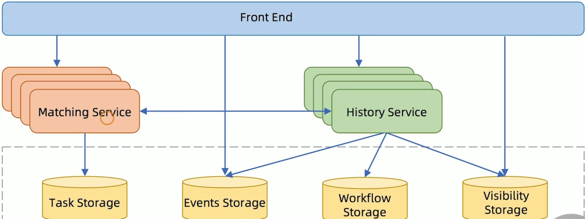
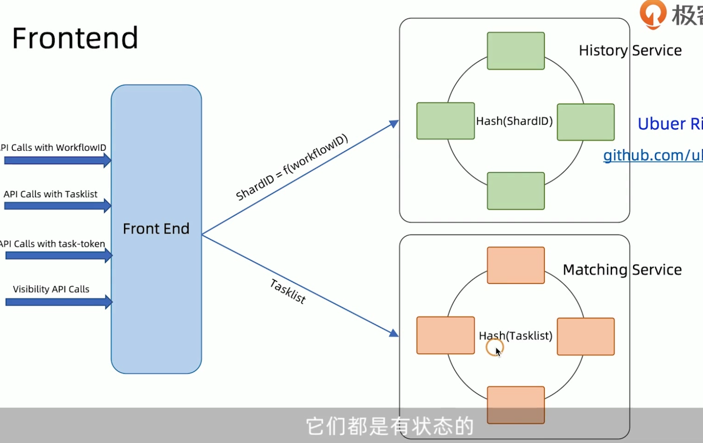

# Uber Cadenec 

> Cadence is a distributed, scalable, durable, and highly available **orchestration engine** to execute **asynchronous long-running** business logic in a scalable and resilient way.
> 

在cadence项目github首页介绍中，如上描述。最重要的有两点。cadence是一个编排引擎,也称为工作流引擎。cadence还是一个分布式的工作流引擎，和适用于异步长事务场景的工作流引擎，当然也支持短事务，但核心的执行引擎是异步的。

编排引擎和工作流引擎其实是一个类似的概念，但是在cadenece的官方站点[https://cadenceworkflow.io/](https://cadenceworkflow.io/)中，作者也叫他 `Fault-Tolerant Stateful Code Platform`，即容错状态代码平台。

在官方站点的use cases中，我们可以看到cadence的一些适用场景，如编排，事件驱动应用，任务批处理，大数据机器学习等。个人认为其实对于cadenece这个产品的定位，作者也不太明确。但是cadence的核心是明确的，就是一个**分布式的通用的编排或者工作流引擎**。既然是通用的编排引擎，那么它的应用广泛其实也是合理的。

我们如何来理解cadence这个产品呢？

从抽象的视角来看，cadence是一个分布式的编排或者说工作流引擎。它支持分布式工作流的定义和执行，同时维护工作流的执行状态。

cadence编程模型中有四个主要的角色,在介绍角色之前，需要说明的是，cadence是一个通用的工作流引擎，它的很多术语也借鉴了工作流引擎中的术语。如workflow、activity、Worker、Decider等。

* Activity Worker:  活动执行者，在分布式事务中叫做分支事务执行者。主要用来接收cadence传递过来的活动任务(Activity Task),并执行本地事务。
* workflow worker: 工作流执行者，也叫Decider决策者。在分布式事务场景中，这个角色相当于全局事务流程执行者。 它根据cadence发送过来的这些决策任务(Decision Task)驱动全局事务流程的执行。
* workflow starter: 负责启动整个工作流
* cadence：负责整个工作流的编排和协调。

由于cadence场景很多。根据场景的不通。三种角色也可以被称为其他的名称

# Cadence 微服务架构

* Matching Service   匹配服务，任务派遣Dispatching。他接收来自HistortService的活动或者是决策任务，存储在Task Storage中。他将任务派遣给这些Activity worker或者workflow worker
* History Service,接收starter的启动工作流指令，然后调度决策或者是活动任务，下发给匹配服务去做任务派遣。他也接收来自Activity或者是workflow这些worker的执行响应。根据响应的结果在调度新的决策或者是活动任务。History service将工作流执行的任务步骤记录在工作流存储当做。也将工作流执行过程中发生的事件，记录在事件存储中。也将工作流的状态执行信息保存在Visbitil存储中。
* Front End  类似于BFF服务。是一个门面服务。主要用来屏蔽内部的这些微服务的复杂性。外围的客户端服务只能通过Front End服务与Cadence内部服务交互。

* frontend service  相当于网关 使用自己实现的TCChannnel协议和其他角色通信
* History service 负责workflow 状态变迁
* Matching service 托管tasklist进行task scheduling dispatching
* workr service
	* Decison worker 又叫workflow worker。 本质上就是workflow func,完全考descision task 驱动。decision由cadenece生成。
	* activity worker 靠activity task 驱动。activity task由decision worker 生成

执行流程:

1. 用户发起workflow
2. cadence history 状态发生变化，生成第一个decision task
3. decision worker 轮询到decision task开始执行 workflow func
4. workflow func执行导致history发生变更，生成activify task, 此时该workflow block等待接下来的decision
5. activity worker 轮询到activity task开始执行activity func
6. avtivity func 执行完毕返回给cadence,生成第二个task.
7. ....

# 什么是工作流

我们都知道，任何微小的工作，都可以拆分成多个步骤，这些步骤顺序相连，依次进行，最终输出成果，有些步骤可能存在多个分支，并且最终输出多个成果。**这些步骤依次执行，并且向后传递阶段性信息的流，就是工作流**。

工作流是个很宽泛的概念，审批系统算，容器编排、CI 的 pipeline 也都可以算。不同的工作流系统设计上有它的侧重点，所以可复杂可简单。但本质上（不是很精确的解释哈），都是在解决「流程的定义」和「流程的执行」这两件事。

1. 流程定义就是说设计一种数据结构，来表达业务流程，通常来说最后会落地成一张有向图（图结构）。实际系统中，由于流程可能会非常复杂，或者说需要可视化的与业务方人员沟通，这时就涉及到了流程的建模。
2. 流程执行就是核心功能了，简单的说就是读进流程定义，创建流程的实例（用来持久化流程相关的用户数据和状态），根据流程和实例的状态来执行流程。

