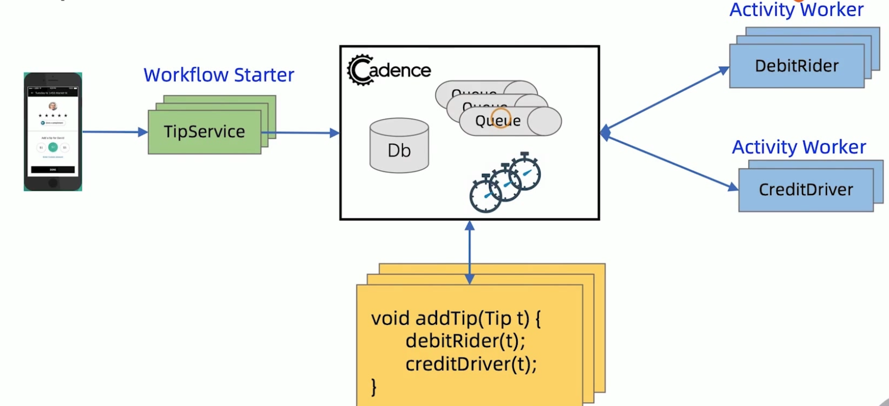

[TOC]

# Uber Cadenec 

> Cadence is a distributed, scalable, durable, and highly available **orchestration engine** to execute **asynchronous long-running** business logic in a scalable and resilient way.
> 

在cadence项目github首页介绍中，如上描述。最重要的有两点。cadence是一个编排引擎,也称为工作流引擎。cadence还是一个分布式的工作流引擎，和适用于异步长事务场景的工作流引擎，当然也支持短事务，但核心的执行引擎是异步的。

编排引擎和工作流引擎其实是一个类似的概念，但是在cadenece的官方站点[https://cadenceworkflow.io/](https://cadenceworkflow.io/)中，作者也叫他 `Fault-Tolerant Stateful Code Platform`，即容错状态代码平台。

在官方站点的use cases中，我们可以看到cadence的一些适用场景，如编排，事件驱动应用，任务批处理，大数据机器学习等。个人认为其实对于cadenece这个产品的定位，作者也不太明确。但是cadence的核心是明确的，就是一个**分布式的通用的编排或者工作流引擎**。既然是通用的编排引擎，那么它的应用广泛其实也是合理的。

我们如何来理解cadence这个产品呢？

从抽象的视角来看，cadence是一个分布式的编排或者说工作流引擎。它支持分布式工作流的定义和执行，同时维护工作流的执行状态。

cadence编程模型中有四个主要的角色,在介绍角色之前，需要说明的是，cadence是一个通用的工作流引擎，它的很多术语也借鉴了工作流引擎中的术语。如workflow、activity、Worker、Decider等。

* Activity Worker:  活动执行者，在分布式事务中叫做分支事务执行者。主要用来接收cadence传递过来的活动任务(Activity Task),并执行本地事务。
* workflow worker: 工作流执行者，也叫Decider决策者。在分布式事务场景中，这个角色相当于全局事务流程执行者。 它根据cadence发送过来的这些决策任务(Decision Task)驱动全局事务流程的执行。
* workflow starter: 负责启动整个工作流
* cadence：负责整个工作流的编排和协调。

由于cadence场景很多。根据场景的不通。三种角色也可以被称为其他的名称

