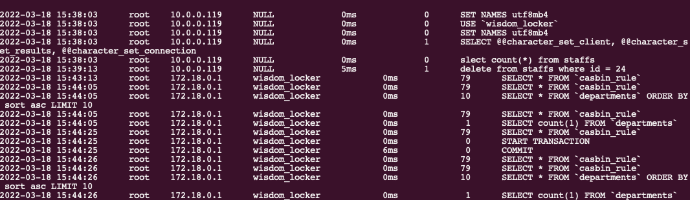

# 背景

数据库审计是数据库安全中很重要的一个环节。

举一个和我们工作很贴近的例子，比如某一个业务在某个时间点出现了异常，因为异常操作（比如DDL）导致系统出现了严重的问题，这个时候如果要查看这个问题的具体情况，谁登陆了系统，什么时候登陆的，做了什么操作等等。

当然，开审计的功能势必会影响性能，如果不开又会有遗漏。但是为了防患于未然，把问题都扼杀在摇篮之中，通过这种规范和制度来做最后一道防线，数据库审计还是非常有必要的。

# 审计作用

> 主要将用户对数据库的各类操作行为记录审计日志，以便日后进行跟踪、查询、分析，以实现对用户操作的监控和审计。


# Mysql审计工具

| 名称        | 文档          | 说明  |
| ------------- |:-------------:| -----:|
|  mysql-audit     | [https://github.com/mcafee/mysql-audit](https://github.com/mcafee/mysql-audit) | 开源插件,由macfee(迈克菲)公司贡献。有名的安全公司 |
| mysql-sniffer     | [https://github.com/Qihoo360/mysql-sniffer/blob/master/README_CN.md](https://github.com/Qihoo360/mysql-sniffer/blob/master/README_CN.md) |  基于流量的数据库审计，通过MySQL 协议进行抓包记录审计日志。不影响数据库服务器性能，不用苦口婆心的劝数据库管理员安装监控软件。由国内安全公司360贡献。 |
| server_audit     | [https://mariadb.com/kb/en/mariadb-audit-plugin-installation/](https://mariadb.com/kb/en/mariadb-audit-plugin-installation/)     |   MariaDB 开源插件，由于Mysql和MariaDB属于同源的开源软件，也可以使用，但是要找合适的版本 |


## mysql-audit

### 介绍

官方文档: [https://github.com/mcafee/mysql-audit/wiki/Installation](https://github.com/mcafee/mysql-audit/wiki/Installation)

MySQL审计插件是一个来自McAfee的MySQL插件，为MySQL提供审计功能，设计的重点是安全性和审计需求。该插件可以作为独立的审计解决方案使用，也可以配置为向外部监控工具提供数据

## 安装

### Mysql二进制

* 插件下载地址： [https://github.com/mcafee/mysql-audit/releases.](https://github.com/mcafee/mysql-audit/releases)  注意选择对应的mysql版本。

* 查看mysql插件目录

	```mysql
	show global variables like 'plugin_dir';
	
	+---------------+------------------------+
	| Variable_name | Value                  |
	+---------------+------------------------+
	| plugin_dir    | /usr/lib/mysql/plugin/ |
	+---------------+------------------------+
	1 row in set (0.00 sec)
	```

* 解压插件拷贝到插件目录下

	```bash
	unzip audit-plugin-mysql-5.7-1.1.10-980-linux-x86_64.zip
	
	# 拷贝到插件目录
	cp ./audit-plugin-mysql-5.7-1.1.10-980/lib/libaudit_plugin.so /usr/lib/mysql/plugin
	
	cp ./audit-plugin-mysql-5.7-1.1.10-980/utils/offset-extract.sh dy_mysql:
	```

* 安装插件

 需要说明：安装方式有两种，一种是使用配置文件方式，另一种是命令方式。
 
 官方建议生产环境使用配置文件方式。打开映射的配置文件my.cnf，增加配置: 
 
	 ```bash
	  [mysqld]
	 plugin-load=AUDIT=libaudit_plugin.so 
	 ```

* 重启mysql
* 验证

	```bash
	show global status like 'AUDIT_version';
	```
	
### docker 方式

* docker 启动:

```bash
docker run -d --name mysql-audit -p 13306:3306 -v $(pwd)/datadir:/opt/mysql/data -v $(pwd)/conf/my.cnf:/etc/my.cnf harbor.sxidc.com/yfhub/mysql/audit:latest
```


* docker-compose.yalm

```bash
version: '3'
services:
  dy_mysql:
    restart: always
    image: harbor.sxidc.com/yfhub/mysql/audit:latest
    container_name: mysql-audit
    volumes:
      - ./datadir:/opt/mysql/data
      - ./conf/my.cnf:/etc/my.cnf
    ports:
      - 23306:3306
```

* 第一次启动修改root密码

```bash
# 登录容器
docker exec -it mysql-audit bash

# 查看临时密码
cat /var/log/mysql/error.log | grep "temporary password"
2022-03-23T15:01:55.616902+08:00 1 [Note] A temporary password is generated for root@localhost: pjee-7%9;Ksd

# 登录mysql
mysql -uroot -p

# 修改root密码
alter user user() identified by "duyong";

# 查看插件版本,确保插件安装
show global status like 'AUDIT_version';
```
* 审计日志目录
* 
```bash
cat $(pwd)/datadir/mysql-audit.json
```


# mysql-sniffer

基于流量的数据库审计，因为它不需要更改网络结构，并且也是最关键的是，不影响数据库服务器性能，不用苦口婆心的劝数据库管理员安装监控软件。它可以比较好的发现通过Web漏洞的拖库行为，以及基于数据库通讯协议的数据库管理过程中的违规行为。

ySQL Sniffer。MySQLSniffer是一个基于MySQL协议的抓包工具，实时抓取请求，并格式化输出。输出内容包括访问时间、访问用户、来源IP、访问 Database、命令耗时、返回数据行数、执行语句等。

## 下载安装

可以直接查看说明文档，自己进行编译安装。我这里偷懒了，直接从docker仓库中找一个别人编译好的环境，然后将可执行文件拷贝出来使用。


```bash
docker pull sliceoflife07/mysql-sniffer

docker run -it -d --name sniffer sliceoflife07/mysql-sniffer

sudo docker cp sniffer:/root/mysql-sniffer/proj/bin/mysql-sniffer ./

# 启动
sudo ./mysql-sniffer -i vethf5b5af3  -p 3306

# 如果是docker启动的mysql,最好是找到容器的虚拟网卡。
```



# Postgresql审计工具

# 参考

[http://www.postgres.cn/news/viewone/1/309](http://www.postgres.cn/news/viewone/1/309)

## 二进制安装

### 依赖

```bash
apt-get install -y --no-install-recommends 
apt install -y make gcc
apt install -y make
apt install -y postgresql-server-dev-14
apt install -y libkrb5-dev
```

### 下载安装

```bash
# 下载源码
https://github.com/pgaudit/pgaudit/tree/1.6.2

make install USE_PGXS=1
```

### 配置文件中配置

```bash
vim /var/lib/postgresql/data/postgresql.conf
shared_preload_libraries=pgaudit
```

## docker方式

* docker方式

```bash
docker run --name dy-pgsql -d -e POSTGRES_PASSWORD=duyong  harbor.sxidc.com/yfhub/postgres/audit
```

*  docker-compose

```yaml
version: '3.1'

services:
  postgres:
    container_name: duyong_postgres
    image: harbor.sxidc.com/yfhub/postgres/audit
    restart: always
    environment:
      POSTGRES_USER: root
      POSTGRES_PASSWORD: root
      POSTGRES_DB: duyong
    ports:
      - 5432:5432
    volumes:
      - ./data:/var/lib/postgresql/data
  pgadmin4:
    container_name: duyong_pgadmin4
    image: dpage/pgadmin4
    restart: always
    environment:
      PGADMIN_DEFAULT_EMAIL: admin@fskj.com
      PGADMIN_DEFAULT_PASSWORD: 123
    ports:
      - 18080:80
```

*  配置

```bash
# 进入容器
docker exec -it duyong_postgres bash
# 开启
psql -d duyong;
create extension pgaudit;
set pgaudit.log = 'all, -misc';


```

* 测试

```bash
# 容器内执行

select name,setting from pg_settings where name like 'pgaudit%';

            name            |  setting
----------------------------+------------
 pgaudit.log                | all, -misc
 pgaudit.log_catalog        | on
 pgaudit.log_client         | off
 pgaudit.log_level          | log
 pgaudit.log_parameter      | off
 pgaudit.log_relation       | off
 pgaudit.log_rows           | off
 pgaudit.log_statement      | on
 pgaudit.log_statement_once | off
 pgaudit.role               |
(10 rows)
```

* 格式配置


